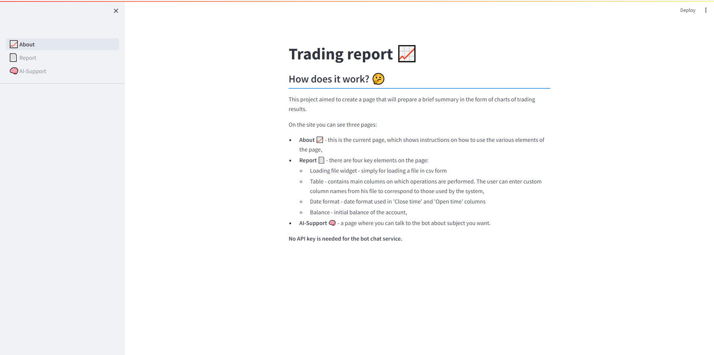

# Stock-Report

This project aimed to create a page that will prepare a brief summary in the form of charts of trading results.

# How it works

The application includes three pages:

- **About** 📈 - this is the current page, which shows instructions on how to use the various elements of the page,
- **Report** 📄 - there are four key elements on the page:
    - Loading file widget - simply for loading a file in csv form
    - Table - contains main columns on which operations are performed. The user can enter custom column names from his file to correspond to those used by the system,
    - Date format - date format used in 'Close time' and 'Open time' columns
    - Balance - initial balance of the account,
- **AI-Support** 🧠 - a page where you can talk to the AI bot **(llama2)** about subject you want.



Data reading is based on the file from the xStation5 platform (XTB), so the data file must be in **csv** format with the following columns:


| Symbol | Position | Type | Lots | Open time | Open price | Close time | Close price | Profit | Net profit | Rollover | Comment |
|:------:|:--------:|:----:|:----:|:---------:|:----------:|:----------:|:-----------:|:------:|:----------:|:--------:|:-------:|

<br>

# Installation
<span style="color: red;">If you want to talk to ai bot, you need to download **llama2** model, which works locally.</span> <br>
Then the project requires the **ollama** program which can be downloaded from the website - [OLLAMA](https://ollama.com/) <br>
Then select **llama2** from the list of models (it was only tested) and install.


Download a repository
```
> git clone https://github.com/mateo252/Stock-Report.git

> cd Stock-Report
```

Create a virtual environment and install requirements (require Python <= 3.11)

```
> python -m venv venv

> venv\Scripts\activate

(venv) > pip install -r requirements.txt
```

Finally run a project
```
(venv) > cd src

(venv) > streamlit run 📈About.py
```

# License
MIT